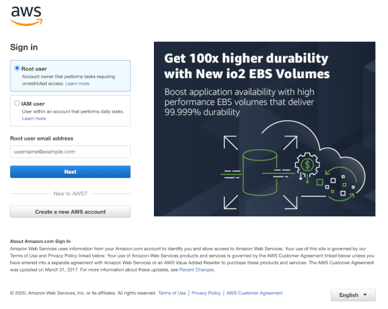
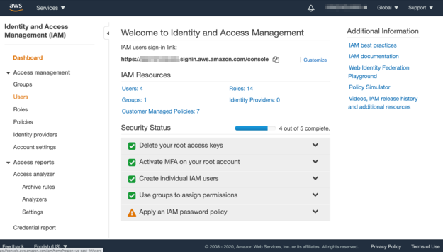
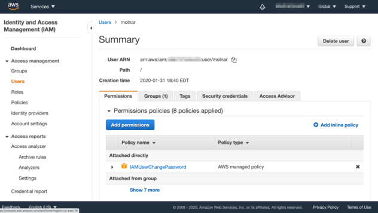
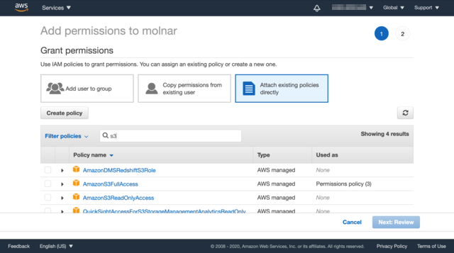
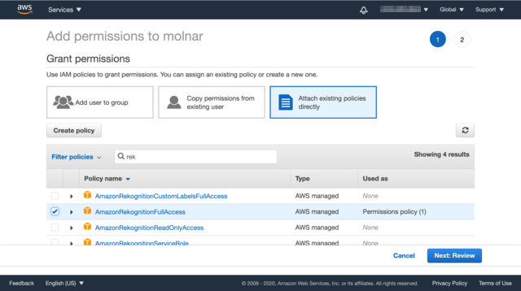

# AWS Account Setup

This document guides through
1. Creating an AWS account
2. Adding a user login to the account, under which the AWS services will be used
3. Configure the new user account with the neccessary permissions to access AWS services

Most computing systems operate on the premise of multiple users with different permissions to access resources. One of those accounts usually has all permissions to everything. This special accounts is often referred to as  "root", "administrator", or "super user".
AWS is not different in that way. The first account you create is the "root" account that allows to control every resource of AWS. However, applications should run under a user account with less permissions.

In order to connect to AWS service in your appliation you need to create a user account and assign the right permissions to access particular services.

## Add user login
After createing an AWS account follow the steps in this video to create a user account:
https://aws.amazon.com/premiumsupport/knowledge-center/create-new-iam-user/

<iframe width="560" height="315" src="https://www.youtube.com/embed/wRzzBb18qUw" frameborder="0" allow="accelerometer; autoplay; clipboard-write; encrypted-media; gyroscope; picture-in-picture" allowfullscreen></iframe>

## Enable Amazon S3 and Amazon Rekognition

We need allow access to Amazon S3 and Amazon Rekognition. The respective policies are `AmazonS3FullAccess` and `AmazonRekognitionFullAccess`

The following shows adding these policies to the user account:

### Step 1 ###
Navigate to the IAM tab on the console. Type "IAM" into the search bar and the service shows up for selection

### Step 2 ###

Select the user account that you want to use for this project. Likely the one that you just created following the video.
First select "Users" on the left navigation pane

Then click on the user name

### Step 3 ###

You see all the details about this user. Click on "Add permissions" to continue

### Step 4 ###

Select the box to the right "Attach existing policies directly". You will see a list of policies. You can scroll through the list the find our policies. However, it's easer to enter part of the name into the search bar.

We want to add `AmazonS3FullAccess` and `AmazonRekognitionFullAccess`.
Enter "S3" into the search bar, and when you find the `AmazonS3FullAccess` policy click on the chech box

Do the same for Amazon Rekognition

When done click on "Next: Review"

### Step 5 ### 

Review the plocies for the user. Then click on "Add permission" to complete the task.

